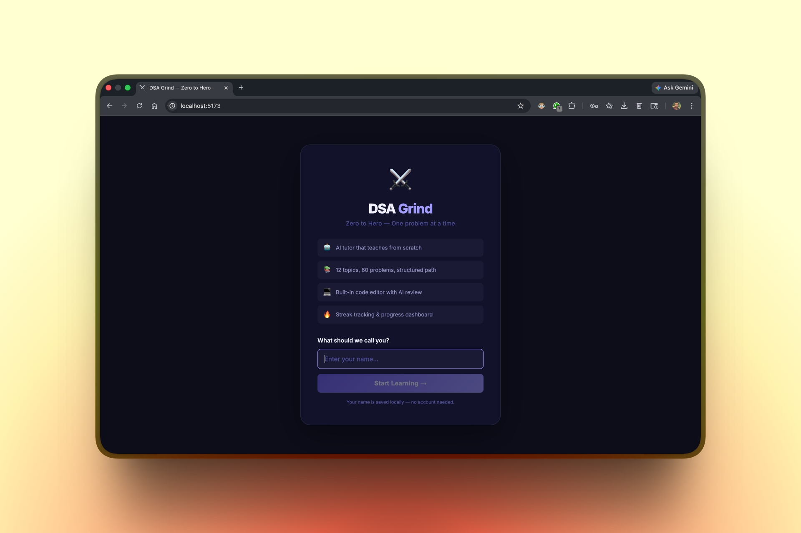
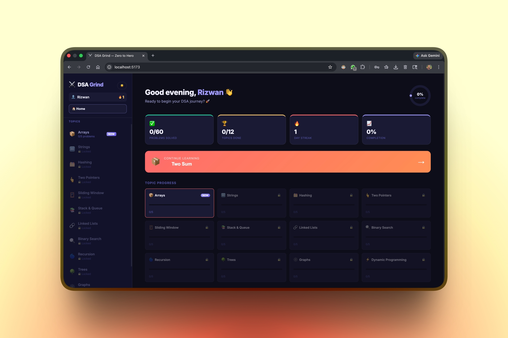
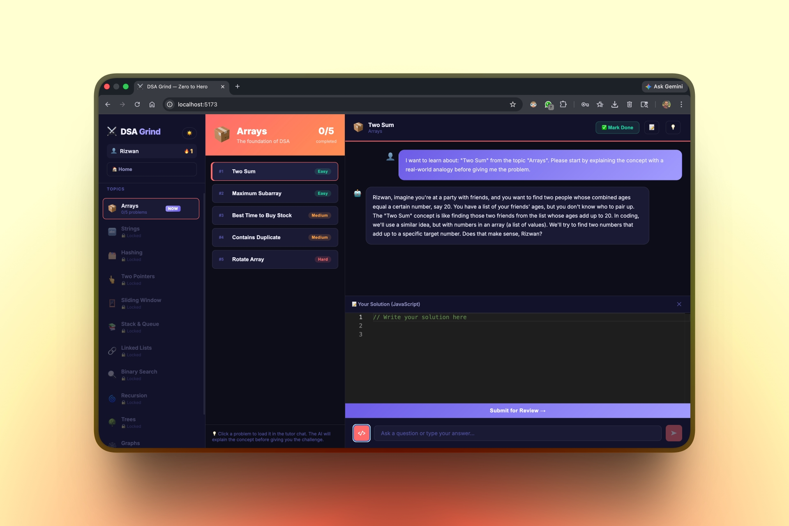

# ⚔️ DSA Grind

> Go from **zero → confident problem solver** with an AI tutor guiding every step.

A structured, AI-powered DSA learning app built for developers who want to master problem solving — one problem at a time.

---

## 🚀 Preview

<p align="center">
  
  
  
</p>

---

## ✨ Why This Exists

Most platforms:

* Throw problems at you ❌
* Assume prior knowledge ❌
* Don’t explain *why* things work ❌

**DSA Grind does the opposite:**

* Teaches from **absolute zero**
* Uses **real-world analogies**
* Guides you step-by-step like a mentor

---

## ✨ Core Features

* 📚 **12 structured topics** (Arrays → DP)
* 🔒 **Locked progression** — learn in order, no overwhelm
* 🤖 **AI tutor (Groq + Llama 3.3 70B)**
  Explains concepts *before* problems
* 💻 **Monaco editor** — solve directly in-app
* 🔍 **AI code review** — feedback + optimized solution
* 💡 **Smart hints** — only after you try
* 💾 **Persistent solutions** — never lose progress
* 📝 **Notes per problem**
* 🔥 **Daily streak tracking**
* 🎯 **One-click next problem flow**
* 🌗 **Dark/light mode**
* ⌨️ **Keyboard shortcuts**

---

## 🧠 How Learning Works

Each problem follows a guided loop:

```
Concept → Attempt → Feedback → Optimization
```

1. **Concept** → Explained like you're a beginner
2. **Attempt** → Solve in Monaco editor
3. **Feedback** → AI reviews your code
4. **Optimization** → Learn the best approach

---

## 📸 Screens Breakdown

### 🚀 Onboarding

First-time user flow with guided setup 

### 📊 Dashboard

Track progress, streaks, and resume instantly 

### 📚 Learning Module

AI tutor + code editor + problem flow 

---

## 🛠️ Tech Stack

| Layer    | Tech                          |
| -------- | ----------------------------- |
| Frontend | React 18, Vite, Monaco Editor |
| Backend  | Node.js, Express              |
| AI       | Groq API (Llama 3.3 70B)      |
| Database | MongoDB                       |
| Styling  | CSS Variables                 |

---

## 🚀 Getting Started

### Prerequisites

* Node.js 18+
* Groq API key → https://console.groq.com
* MongoDB (local)

---

### 1. Clone

```bash
git clone https://github.com/r6rizwan/DSA-Grind.git
cd DSA-Grind
```

---

### 2. Backend

```bash
cd server
npm install
cp .env.example .env
```

Add:

```
GROQ_API_KEY=your_key
MONGODB_URI=mongodb://localhost:27017/dsa-grind
```

Run:

```bash
npm run dev
```

---

### 3. Frontend

```bash
cd client
npm install
npm run dev
```

---

### 4. Open

```
http://localhost:5173
```

---

## 📁 Project Structure

```
DSA-Grind/
├── Images/
├── server/
└── client/
```

---

## 📚 Topics Covered

Arrays, Strings, Hashing, Two Pointers, Sliding Window, Stack & Queue, Linked Lists, Binary Search, Recursion, Trees, Graphs, Dynamic Programming

---

## 🔑 Environment Variables

| Variable     | Description        |
| ------------ | ------------------ |
| GROQ_API_KEY | Groq API key       |
| MONGODB_URI  | MongoDB connection |

---

## 📄 License

MIT License
